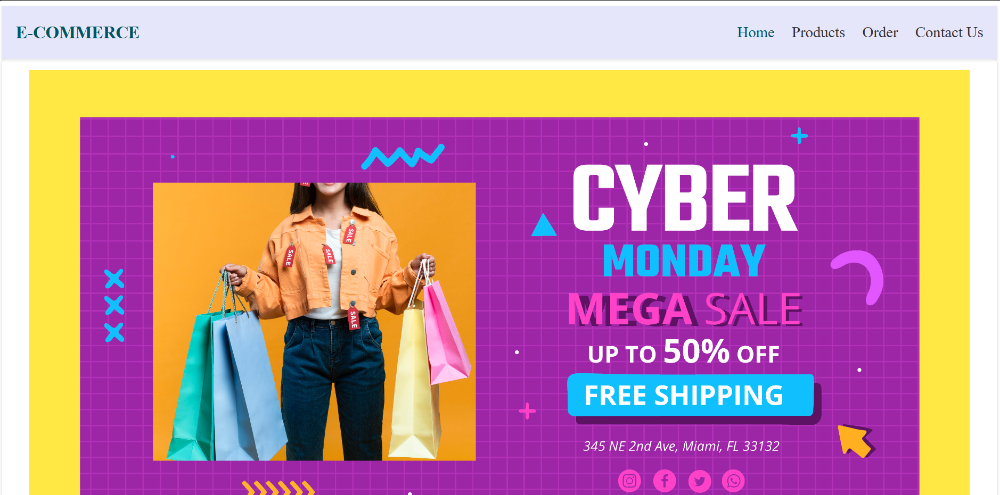
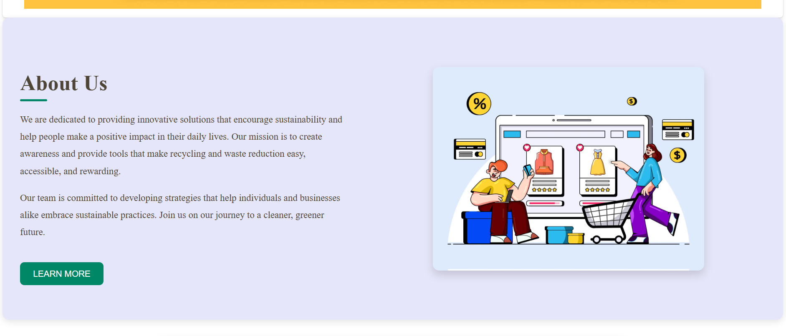
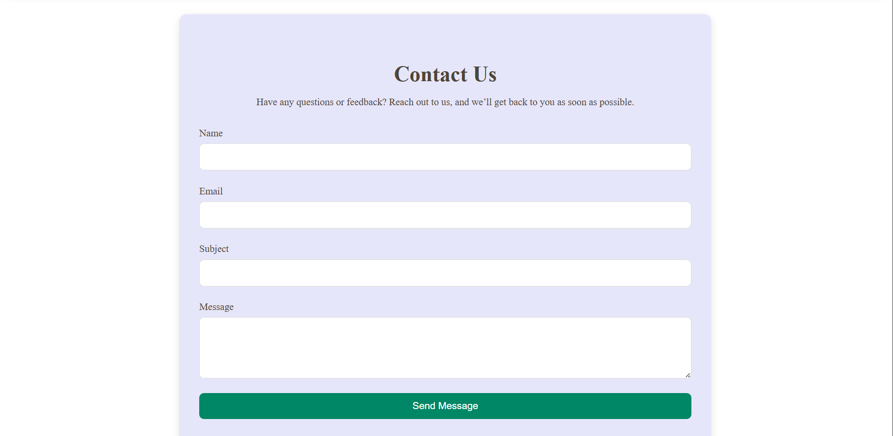
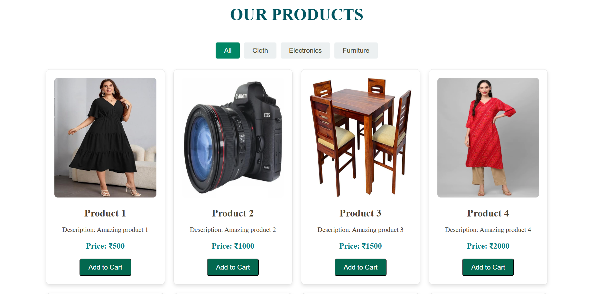
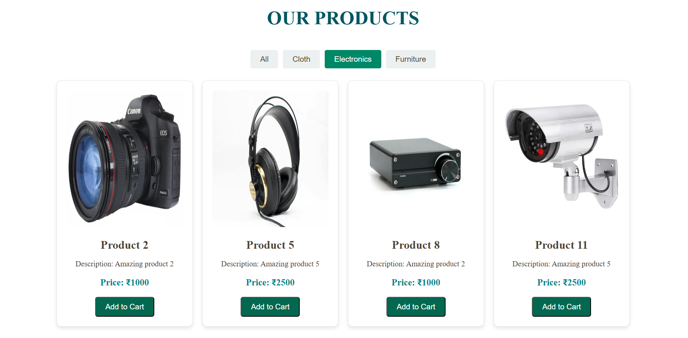
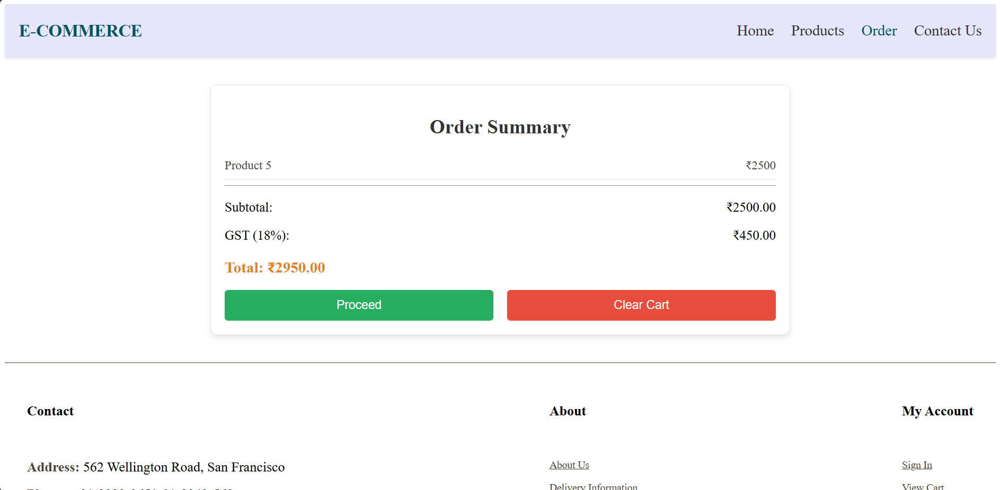
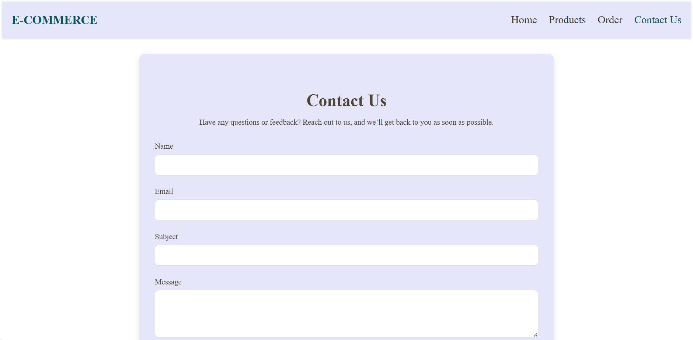

# E-Commerce Website

An e-commerce platform built using **Vue.js** to provide a seamless shopping experience with features like product listings, user authentication, shopping cart, and more.

## Table of Contents

- [Demo](#demo)
- [Screenshots](#screenshots)
- [Technologies Used](#technologies-used)
- [Project Structure](#project-structure)
- [Getting Started](#getting-started)
- [Installation](#installation)
- [Usage](#usage)


---

## Demo

You can check out the live demo of the website [here](#) _(replace with your link if available)_.


## Screenshots


Home Page   
 
 
 
Product Page
 
 
Cart
    
Contact Page
   
 
      
## Technologies Used

- **Frontend**: Vue.js, Vue Router

## Project Structure

├── public
│ ├── index.html
│ └── ...
├── src
│ ├── assets
│ ├── components
│ ├── views
│ ├── router
│ │ └── index.js
│ ├── store
│ │ └── index.js
│ ├── services
│ │ └── api.js
│ ├── App.vue
│ ├── main.js
│ └── ...
├── .env
├── package.json
└── README.md

## Getting Started

To get a local copy up and running, follow these steps.

### Prerequisites

- [Node.js](https://nodejs.org/en/) (v14 or later)
- [Vue CLI](https://cli.vuejs.org/)

### Installation

1. Clone the repository:
   ```bash
   git clone https://github.com/yourusername/e-commerce-vue.git
   ```
2. Navigate to the project directory:
   ```cd e-commerce-vue
   ```
3. Install dependencies:
   ```npm install
   ```

### Usage
1. Start the development server:
   ```npm run serve
   ```
   Open your browser and visit: http://localhost:8080

### Build for Production
- **To create a production build, run:**
    ```npm run build
    ```
- **Linting**
    To lint your code, use: 
        ```npm run lint
        ```
